# AWS Certified Data Engineer Associate
These notes are from teh Udemy course found at: https://www.udemy.com/course/aws-data-engineer/?kw=AWS+Certified+Data+Engineer&src=sac&couponCode=CP251120G2V2

Sections covered are:
- **Data Engineering Fundamentals**
- **Storage**
- **Database**
- **Migraton and Transfer**
- **Compute**
- **Containers**
- **Analytics**
- **Application Integration**
- **Security, Identity, and Compliance**
- **Networking and Content Delivery**
- **Management and Governance**
- **Machine Learning**
- **Developer Tools**
- **Everything Else**

Let's get into it

# Data Engineering Fundamentals
This section is a review of some data engineering topics that are questioned on the exam.

## Types of Data
There are three types of data:

### Structured Data
This is data that is organized in a defined manner or schema, typically found in relational databases.

Characteristics are:
- Easily queriable
- Organized in ros ndd columns
- Has a consistent structures

Some examples are:
- Database tables
- CSV files with consistent columns
- Excel spreadsheets

### Unstructured Data
Tis is data that does not have a predefined scema or structure.

Its caracteritic are:
- Not easily queriable without preprocessing
- May come in various formats

And some examples are:
- Text files without a fixed format
- Video and audio files
- Images
- Emails and word processing documents

### Semistructured Data
This is data that is in between structured and unstructured. This is data not as organized as structured data but has some level of structure in form of tags, hierarcies or other patterns.

Its characteristics are:
- Elements might be tagged or categorized in some way
- It's more flexible than structured data but not as chaotic as unstructured data

And some examples are:
- XML and JSON files
- Email headers
- Log files with varied formats

## Properties of Data
There are three ain properties of data: the three V's

**Volume**: refers to the amount or sze of data that organizations are dealing with at any given time. Ots characteristics are:
    - Ranges from GB to PB or more
    - Comes with challenges in storing, processing and analyzing high volumes of data

**Velocity**: refers to the speed at which new data is generated, collected and processed. Some characteristics are:
    - High velocity requires real-tme or near-real-time processing capabilities
    - Rapid ingestion and processing can be critical for certain applications

**Variety**: refers to the different types, structures and sources of data (structured or unstructured, formats and sources).

## Data Warehouses vs Data Lakes
Let's compare these two options of storage so that you can hoose the best option in each scenrio

### Data Warehouses
A **Data Warehouse** is a centralized repository optimized for analysis were data from different sources is stored n a structured format.

Characteristics:
- Designed for complex queries and analysis
- Data is cleant, transformed and loaded (ETL process)
- Typically uses a star or snowflake schema
- Optimized for read-heavy operations

Some examples are:
- **Amazon Redshift**
- **Google Big Query**
- **Azure SQL Data Warehouse**

### Data Lakes
A **Data Lake** is a storage repository that holds a vast amount of raw data in its native format that includes structured, unstructured and semi-structured.

It's characteristics are:
- Can tore arge volumes of raw data without predefined schema
- data is loaded as-is, o need for preprocessing
- Supports batch, real-time and stream processing
- Can be queried for data transformations or exploratio purposes

Some examples are:
- **S3**: Amazon Smple Storage Servie when used as data lake
- **Azure Data Lake Storage**
- **Hadoop Distributed File System**

### Data Wareouse vs Data Lake
- **Schema**:
    - Data Warehouse has a schema-on-write policy (predefined scema before writing the data). ETL
    - Data Lake has a shcema-on-read policy (schema is defined at the time of reading the data). ELT
- **Data Types**:
    - Data Warehouse contains primarily structured data
    - Data Lake can contain any type of data
- **Agility**:
    - Data Warehouse is less agile due to predefined schema (if you need to change the schema, there's a costy migration)
    - Data Lake is more agile as it accepts raw data without a predefined structure
- **Processing**:
    - Data Warehouse uses ETL
    - Data Lake uses ELT
- **Cost**:
    - Data Warehouse tends to e more expensive because of the optimizations needed for complex queries
    - Data Lake is a more cost effective storage solution, but costs can rise when processing large amounts of data

### Choosing between Data Warehouse and data Lake
***Use a Data Warehoue when***:
- You have structured data sources and know the schema upfront
- If you require fast and complex queries
- If data integration from different sources is essential
- If business inteligence and analytics are the primary use cases

***Use Data Lake when***:
- When you have a mixture of data types
- You need a scalable and cost-effective solution to store massive amounts of data
- When your future needs for data are uncertain and want flexibility in storage and processing
- For advanced analysitcs, machine learning or data discovery

### Data Lakehouses
A **Data Lakehouse** is a hybrid data architecture that combines the best features of data lakes and data warehouses, aiming to provide the performance, reliability and capabilities of a data warehouse while maintaining the flexibility, scale and low-cost storage od data lakes

Its characteristics are:
- Supprts both structured and unstructured data
- Allows for schema-on-write and schema-n-read
- Provides capabilities for both detailed analytics and machine learning tasks
- Typically built on top of cloud or distributed architectures
- Benefits from technologies like Delta Lake, which bring ACID transactions to big data

Some examples are:
- **AWS Lake Formation**: uses Redsift Spectrum to query data from S3
- **Delta Lake**
- **Databricks Lakehouse Platform**
- **Azure Synapse Analytics**

## What is a "Data Mesh"?
A **Data Mesh** is a architecture style with rules for governance and ownnership.

The idea behind is that each team is the owner of its data and the different teams share the data of each domain between each other.

There's  federated governance with some cental standards. Each team uses if own tools.

## Managing and Orchestrating ETL Pipelines
**ETL** (Extract, Transform, Load) is a process used to move data from source systems into a data warehouse:

- **Extract**: in this stage you retrieve data from source systems wich can be of any type; ensure data integrity correctness during the extraction phase; and this can be done in real-time or in batches, depending on requirements
- **Transform**: here the data extracted is converted into a format suitable for the target data warehouse. It can involve several operations (data cleansing, data enrichment, format changes, aggregations or computations. encoding and decoding, andling missing values...)
- **Load**: consists in moving the transformed data into the datrget data warehouse or data repository. Can be done in batches or streaming. 

The main tool for ETL and ELT that is AWS native is **AWS Glue**. Other orchestration services are:
- EventBridge
- Amazon Managed Workflows for Apache Airflow, AWS
- AWS step Functions
- Lambda
- Glue Workflows

## Other topics
The rest of the topics are too introductory and are skipped in these notes. You may check them at the course itself.

# Data Storage
This section covers the AWS tools for storage of data in the cloud

## Amazon S3
**S3** is one of the main building block sof AWS. ***It is advertised as "infinitely scaling" storage.***

Some use cases are:
- Backup and storage
- Disaster recovery
- Archive data
- Hybrd Cloud Storage
- Application Hosting
- Media Hosting
- data Lakes and big data analytics
- Software delivery
- Static website

### Buckets
Amazon S3 stores data in **Buckets** (directories). Nuckets must have a global unique name across all regions.

However, buckets are defined at the region level.

S3 looks like a global service, but buckets are created in a regions!

### Objects
**Objetcs** in S3 is the name used to refer to files stored in S3. Each object has a ***key*** composed by a prefix and an object name. The prefix refers to the "folder" where the file is stored. 

***Note that S3 does not actually uses folders***, this is merely a UI option, but internally objects are referred by index. By using the same prefix for several objects you are not really storing them in the same folder.

The value of an object is its content:
- Maixmum size of an objetc is 5TB (500GB)
- Files bigger than 5GB require mult-part upload
- Metadata: 
- Tags: to identify files with natural language
- Version ID: a file can be refresed, deleted... this version id indicates the in-use version of the file

### S3 Security
There are several options and security levels available in S3:
- User-based: by implementing IAM policies we can define which API calls should be allowed for a specific user from IAM
- Resource-Based:
    - Bucket Policies: these are bucket-wide rules from the S3 console, allowing cross account
    - Object Access Control List (ACL): finer grain
    - Bucket Access Control List
- Encryption: using encryption keys to secure the content of an object

#### S3 Bucket Policies
S3 Bucket policies are implemented using JSON files: these are JSON files containing the details of the scurity rules:
```json
{
    "Version":"2013-10-17",
    "Statement":[
        {
            "Sid":"Publicread",
            "Effect":"Allow",
            "Principal":"*",
            "Action": [
                "s3:GetObject"
            ],
            "Resource":[
                "arn:aws:s3:::examplebucket"
            ]
        }
    ]
}
```

The JSON contains the following details:
- The resources to be affected (buckets and objects)
- The effect of the rule (Allow or Deny)
- The actions: a set of API calls to Allow or Deny
- The principal: the account or user to apply the poliy to

You should use S3 bucket policies for:
- Grant public access to the bucket
- Force objects to be encrypted at upload
- Grant access to another account (Cross Account)

### S3 Versioning
S3 allows file versioning at the bucket level. ***This is not enabled by detault, you need to enable it***. Files uploaded before enabling versioning will have a NULL version id.

A new version of the object with the same key but with a different version id is available in the S3 Bucket. And rollback is also available through this versioning.

To roll back, you can simply delete the file containing the version.

Now, when you delete a file for good, you are actually deleting with a marker, so that it is still stored with a new version id. If you delete the version of the delete marker, the file will be restored.

### S3 Replication
There are two types of replication:
- **Cross Region Replication**: creates an extra bucket n another region
- **Same Region Replication**

***Buckets can be defined in different AWS accounts***
The requirements are:
- To implement relication, the buckets must have versioning enable
- Buckets must be given proper IAM permissions to the other S3 bucket

Some use cases are:
- CRR: Compliance, providing lower latency, data replication accorss accounts
- SRR: log aggregation, live replication between production and test accounts.

***Replication will automatically happen only for files created after the enabling of replication***. For previous files you need to use **S3 Batch Replication**, which replicates existing objetcs as well as files whose replication failed.

Also, for delete operations:
- Delete markers can be replicated from source to target
- Deletions with a version ID are not replciated

Finally, chain of replication is not allowed: if bucket 1 replicates to bucket 2 and bucket 2 replicates to bucket 3, objects from bucket 1 will NOT replicate to bucket 3.

### S3 Storage Classes
S3 comes with different storage classes. When you create an object in S3 you can choose the storage class to use for it as well as set S3 lifecycle configurations. 

#### S3 Durability and Availability
S3 comes wih a high **durability** for all storage classes, of 99.999999999%, 11'9 s (losing an object every 10.000 years)

As for the **availability**, it differs for eac class

#### S3 Classes
Classes are:
- **Amazon S3 Standard - General Purpose**:
    - Comes with 99.99% availability
    - Used for frequently accessed data
    - Low latency and high throughput
    - Sustain 2 concurrent facility failures
    - Use cases: big data analytics, mobile and gamiing apps, ocntent distribution...

- **Amazon S3 Standard - Infrequent Access**:
    - This is for data less frequently access then General Purpose, but requires rapid access when needed
    - Has a lower cost, but comes with a retrieval cost
    - Has 99'9% availability
    - Use cases: disaster recovery, backups

- **Amazon S3 One Zone - Infrequent Access**:
    - Same as Standard Infrequent Access, except only stored in a single zone
    - If the AWS Zone facility loses the data, the data is lost forever (no interzone replication)
    - 99'5% availability
    - Use cases: sotre secondary backup copies of on-premise data or data you can recreate

- **Amazon S3 Glacier Instant Retrieval**:
    - Low cost object storage meant for archiving and backup
    - Pricing consist on a base low cost plus retirevl cost per query
    - Comes with a ms retrieval tme
    - Minimum sotrage duration is 90 days

- **Amazon S3 Glacier Flexible Retrieval**:
    - Low cost object storage meant for archiving and backup
    - Pricing consist on a base low cost plus retireval cost per query
    - Retrieval has classes:
        - Expedited (1 to 5 minutes retrieval time)
        - Standard (3 to 5 hours retrieavl time)
        - Bulk (5 to 12 hours retrieval time) - Free retireval
    Minimum storage duration is 90 days
- **Amazon S3 Glacier Deep Archive**:
    - Low cost object storage meant for archiving and backup
    - Pricing consist on a base low cost plus retireval cost per query
    - Classes are:
        - Standard (12 hours)
        - Bulk (48 hours)
        - Minimum Storage duration is 180 days

- **Amazon S3 Intelligent Tiering**: allows to move objects between classes.
    - Uses an auto-tiering fee
    - Moves objects automatically between AccessTiers based on usage
    - There are no retrieval charges in S3 Intelligent Tiering
    - Tiers are:
        - ***Frequent Access Tier*** (*automatic*): default tier
        - ***Infrequent Access Tier*** (*automatic*): objects not accessed for 30 days
        - ***Archive Instant Access Tier*** (*automatic*): objects not accessed for 90 days
        - ***Archive Access tier*** (*optional*): confgurable from 90 to +700 days
        - ***Deep archive Access tier*** (*optional*): configurable from 180 days to +700 days


### S3 Express One Zone
This is a special sotrage class:
- High performance for a single Availability Zone
- Objects are NOT stored in a normal bucket
- Objects ar **stored in a Directory Bucket** (bucket in a single AZ)
- Handle 100.000 requests per second with single-digit milisecond latency
- Up to x10 better performance then S3 Standard (50% lower costs)
- High durability (99'999999999%) and availability (99'95%)
- Co.locate your storage and compute resources in the same AZ (reduces latency)
- ***You allocate your compute and storage resouces in the same availability zone and reduce our network and storage costs***. Data is stored in a single AZ
- Use cases: latency-sensitive apps, data-intensive apps, AI & ML training, financial modeling, media processing, HPC...
- Best integrated with SageMaker Model Training, Athena, EMR, Glue...

### S3 Lifecycles Rules
These are rules you can set on your buckets to manage the Strage class used for the objects in them.

There are different type of lifecycle rules:
- ***Transition actions***: configure objetcs to transition to another storage class
- ***Expiration Actions***: configure objects expiration (deletion) after some time. Examples:
    - Access log files can be set to delete after 365 days
    - Delete old versions of files ( if versioning is enabled)
    - Delete multi part uploads

Rules cn be crated for a certain prefix ("folder")

Also, rulse can be created for certain object Tags

#### Storage Class Transition Optimization: S3 Analyics
S3 Analytics is a built-in tool that helps you decide when to transition objects to the right storage class.

The recommendations only work for Standard and Standard IA.

Reports are generated and updated daily (takes from 24 to 48 hours to start providing data)

### S3 Event Notifications
Events happening in S3 can be notified through different available AWS tools (SNS, SQS, Lambda, EventBridge).

You can set up automatic reactions trhough the S3 notifications

First, you need to create a IAM Permission for the service that will be trigered upon the event:
- SNS Resource (Access) Policy
- SQS Resource (Access) Policy
- Lambda Resource Policy

Note that these are NOT IAM roles, but IAM policies.

### S3 Baseline Performance
Amazon S3 automatically scales to high requests rates , latency 100-200ms

Your application can cachieve at least 3.500 PUT/COPY/POST/DELETE or 5.500 GET/HEAD requests per second per prefix in a bucket.

And there are NO limits of prefixes in a bucket.

This means that ***if you spread reads across different prefixes evenly, you can achieve a higher amount of available request per second***

#### Optimize S3 Performance: Uploads
There are several methods to attain this optimization:
- ***Multipart Upload***: instead of uploading a single files, you can partition them (recommended for files >100MB and compulsory for files >5GB). It can help parallelize uploads
- ***S3 Transfer Acceleration***: increases the transfer speed by trasferring files to AWS edge locations which will forard the data to the S3 bucket in the target region (uses a "bridge" location to move the file to the target location).

#### Optimize S3 Performance: Reads
There is a feature called **S3 Byte-Range Fetches**.

This feature:
- parallelize GETs be requesting specific byte ranges
- Has better resilience in case of failures
- Can be used to speed up downloads
- Can be used to retrieve only a partial part of the file

### S3 - Object Encryption
S3 allows users to encryp objects using 4 different methods:
- **Server-Side Encryption (SSD)**:
    - ***Server-Side Ecryption with Amazon S3-Managed Keys (SSE-S3)***
    - ***Served-Side Encryption with KMS Keys stored in AWS KMS (SSE-KMS)***
    - ***Server-Side Encryption with Customer-Provided Keys (SSE-C)***
- **Client-Side Encryption**: encrypted on client side before uploading to S3

Changing the encryption type of an object will create a new version if versioning is enabled.

#### Server-Side Ecryption with Amazon S3-Managed Keys (SSE-S3)
Encryption is done using keys handled, managed and owned by AWS
- Object is encrypted server-side
- Encryption type is AES-256
- Must set header "x-amz-server-side-encription":"AES256"
- ***Enabled by default for new buckets & new objects***

#### Served-Side Encryption with KMS Keys stored in AWS KMS (SSE-KMS)
The user managed its keys using the AWS KMS (Key Managed Service).

- KMS provides user control and audit capabilities of the keys by using CloudTrail
- Object is still encrypted server-side
- HEader must be set "x-amz-server-side-encryption":"aw:kms"

KMS has some limitations regarding quotas


#### Served-Side Encryption with Customer-Provided Keys (SSE-C)
This is a Server-Side Encryption using keys fully managed by the customer outside AWS
- AWS S3 does NOT store the encryption key you provide
- HTTPS must be used
- Encryption key must be provided in HTTP headers for every HTTP request made

#### Client-Side Encryption
Uses cleint libraries such as Amazon S3 Client-Side Encryption Library
- Clients must encrypt data themselves before sending it to amazon S3
- Clients must decrypt data themselves when retrieving from Amazon S3
- Customer fully manages the keys and encryption cycle

#### Encryption in transit (SSL/TLS)
Encryption in flight is also called SSL/TLS

Amazon S3 exposes two endpoints:
- HTTP Endpoint - non encrypted
- HHTPS Endpoint - encryption in flight (mandatory for SSE-C)

To force encryption in transit you can use a bucket policy:
```json
"Condition":{
    "Bool":{
        "aws:SecureTransport":"false" 
    }
}
```

Using this condition will reject files with SecureTransport=false (HTTP) and only accepting files SecureTransport=true (HTTPS)

### S3 Access Points
**Access Points** act as endpoints through policies that allow to set certain access ermissions to users or groups of users.

Access Points simplify security management for S3 buckets. Each access point has:
- its own DNS name (Internet origin or VPC origin)
- an access point policy (similar to bucket policy) - manage security at scale

They can be defined to be privately accessible onl from the VPC origin. In order to do that you must create a VPC endpoint to access the Access Point. The VPC Endpoint must have a policy that allows access to the target bucket and Access Point

### S3 Object Lambda
The idea behind is to have an object modifid before it's retrieved by the caller application. Happens in-place without creating an extra version.

Works by using a S3 bucket on top of which we create a S3 Access point and a S3 Object Lambda Access Point (using the Lambda function).

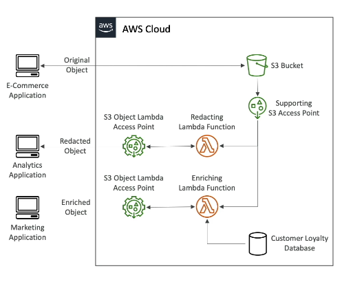

### S3 Storage Lens
This is a service used to understand, analyze and optimize storage accoss the entire AWS Organization:
- Discover anomaies, identiy cost effficiencies, and apply data protection best practices accross entire AWS Organizations (30 days usage and activity metrics)
- Aggregate data for Organization, specific accounts, regions, buckets, or prefixes
- Default dashboard or create your own dashboards
- Can be configures to export metrics daily to an S3 bucket (CSV, Parquet)

## Amazon EC2 Storage Instances
There are different types of EC2 storage instanes available in AWS. EC2 are vritual machines, and they require some underlying storage. These types are:
- EBS Volumes
- EFS Volumes

### Amazon EBS
An **EBS Volume** is a ***elastic block store***, a network drive you can attach to your instances while they run. Its is a network-attached storage that behaves like a local disk. (with very low latency).
- It allows to persist instance to your instances, even after termination
- They can only be mounted to one EC2 instance at a time (at CCP (Certified Cloud Practitioner) level)
- They ar bound to a specific availability zone

You can think of them as network USB sticks to attach networks.

***EBS Volumes are network drives***:
- Use network to communicate the instance (EC2), which means there might be a bit of latency
- It can be detached from an EC2 instance and attached to another one
- It's locked to n Availavility Zone: an EBS Volume in a zone cannot be attached to a EC2 instance in another zone
- To move a volume to another region, you first need to snapshot it
- You need to provision it in advance with you desire resources (size in GBS and IOPS)

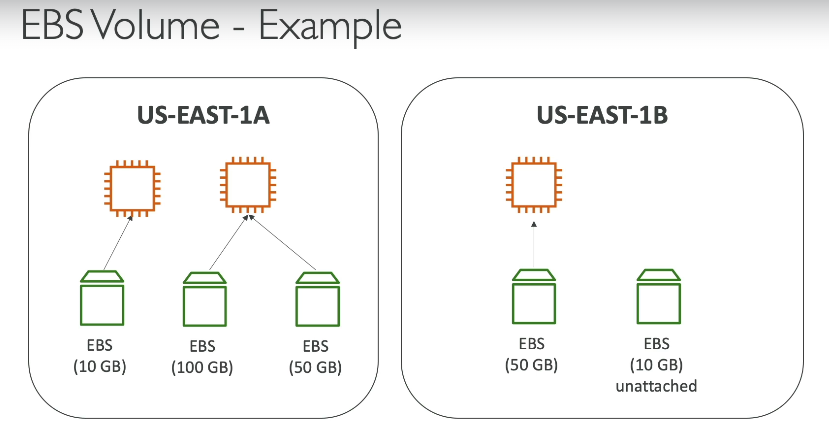

Finally, when creating EBS volumes for a EC2 instance, there's an option called ***delete on termination***, that, by default, once the EC2 instance is terminted, the EBS will be deleted. If you wnat to preserve data, you need to unable this option.

#### EBS Elastic Volumes
These are volumes that can grow or decraase size as needed based on needs of your storage.

For doing this you don't need t restart the instance or detach the volume.

You can also change the volume type

### Amazon EFS
**Amazon EFS** (Elastic File System) is another Sotrage option available for your EC2 Virtual Machines. It is a ***managed NFS (Network File System) that can be ounted on many EC2***. It works in multi-availability zones mode too.

It is:
- Highly available
- Scalable
- Very expensive
- Uses NFSv4.I protocol
- Uses security group to control access to EFS
- *Only compatible with Linux based AMI*
- Uses encryption at rest with KMS
- Uses POSIX file system (Linux) and has a standard file API
- The file system scales automaticaaly, pay-per-use, no need to do capacity-planning

Some use cases are:
- Content Management
- Web Serving
- Data sharing
- Wordpress hosting

#### EFS Performance Modes
This is set at cretion time. There are two performance modes:
- *General Purpose*, which is the default mode, and is for latency-sensitive use cases (web server, CMS...)
- *Max I/O*, which comes with higher latency and parallelization (for big data, media processing...)

#### Throuhput Modes
Modes are:
- *Bursting*: 1TB of storage with 50MiB/s and burst of up to 100MiB/s
- *Provisioned*: througput is set regardless of storage size
- *Elastic*: automatically scales througput up or down based on your workloads (up to 3Gib/s for reads and 1Gib/s for writes)

#### Storage Classes
There are different options:

- **Storage Tiers**: to moe files from tier based on predefined rules using lifecycles policies:
    - Standard: for frequently accessed files
    - Infrequent: cost to retrieve files but lower storage costs
    - Archive: rarely accessed data

### EBS vs EFS
**EBS volumes**:
- Attached only to one EC2 instance
- Are locked ate the availability zone of the instacne
- To migrate across AZ:
    - Take a snapshot
    - Restore the sanpshot in the new AZ
    - EBS backups use IO and you should not run them while your application is handling a lot of traffic
- Root EBS Volumes get terminated by default when terminating your EC2 instance (can be modified)

**EFS**:
- Can be mounted to hundreds of instaances in different AZ
- EFS share website files 
- It's only for Linux Instances (POSIX)
- It's costlier than EBS
- You can leevrage storage for cost saving

## AWS Backup
**AWS Backup** is a fully managed service that allows to centrally manage and automate backups cross AWS sevices.

There is no need to create custom scripts and manual processes.

Supported services are:
- EC2 & EBS
- S3
- RDS (every DB engine) / Aurora, DynamoDB
- DocumentDV / Neptune
- EFS / FSx
- Storage Gateway
- More

This tool ***supports cross-AZ backups*** and ***supports cross-account backups***

It's main technical characteristics are:
- Supports PITR for supported services
- Has on-demand and scheduled backups
- There are Tag-ased backup policies
- You can create backup policies known as **Backup PLans**, where you define:
    - Backup frequency
    - Backup window
    - Transitio to Cold Storage
    - Retention Period

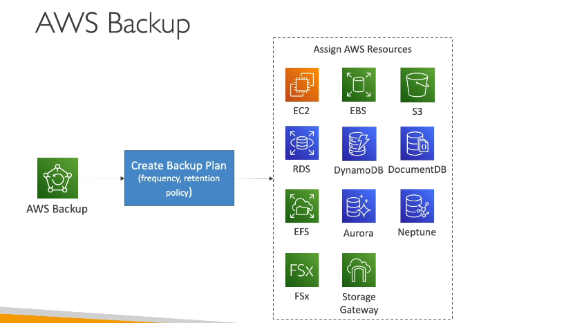

### AWS Backup Vault Lock
This allos to defined additional layers of defense to your backups

# Databases
AWS has a broad variety of database solutions. Let's get into them.

## DynamoDB
***DynamoDB is NoSQL database solution in AWS***.
- NoSQL databases do not support query joins
- NoSQL databses present all te data in a single row
- NoSQL databases don't allow aggreations
- NoSQL databases scale horizontally

Amazon DynamoDB:
- Is a fully managed, higly available NoSQL solution in AWS with replication across multiple AZs
- Scales to massive workloads distributed database
- Supports millions of requests per seconds, trillions of row, hundres of TB of storage
- Has a fast and consistent performance
- Is integrated with IAM for security, authorization and administration
- Enables event driven programming with DynamoDB streams
- Has low cost and auto-scaling capabilities
- Has both Standard and Infrequent Access Table Classes

### DynamoDB Basics
DynamoDB is made of **tables**:
- each table has a PK
- each table can have an infinite number of items (rows)
- each item (row) has attributes (data key-value pairs)
- maximum size of an item is 400KB
- data types supported are:
    - Scalar Types: string, Number, Binary, Boolean, Null
    - Document Types: List, Map
    - Set Types: String Set, Number Set, Binary Set

#### DynamoDB Primary Keys
On your DynamoDB table, it's crutial to choose the right PK. There are several options:
- Using a Partition Key (HASH):
    - The Partition Key will be uniqye
    - It will be diverse, so that the data is evenly distributed
- Partition Key + Sort Key (HASH + RANGE):
    - The combination must be unique for each item
    - Data is grouped by partition key
    - Data is sorted by sort key for those items with the same partition key

#### DynamoDB in Big Data
DynamoDB is a great tool for hota data that needs to be ingested and consume at big scale.

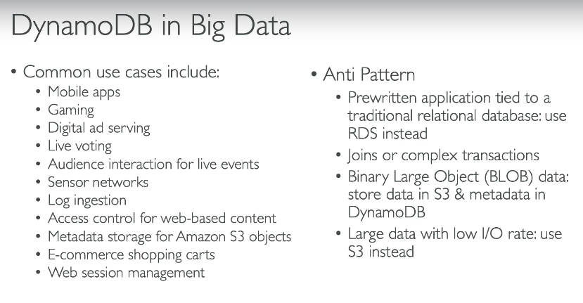

#### DynamoDB Throughput
There are two modes available:
- **Proision Mode**: where you choose the size of your write and read capacities defining a plan beforehand. You pay as in your plan. There's also an autoscaling option; and throughput can be execceded temporarily using *Burst Capacity*
    - ***Write Capacity Units***: 1 WCP represens one write per second for an item up to 1KB in size. *Note, file size is rounded up!*
    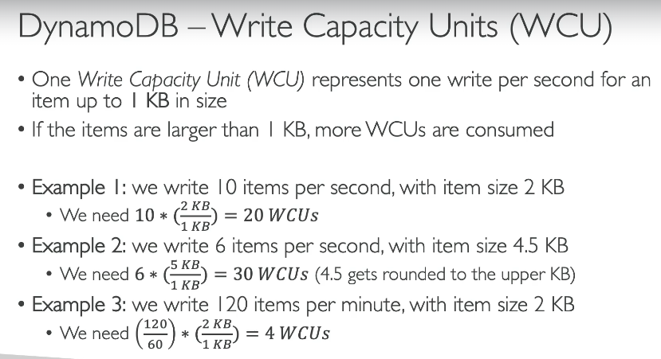

    - Read Modes: there are two read modes:
        - Strongly Consistent read: when we get the most updated data regardless of replication status between servers

        - Eventually Consitent Read: when replication between servers is not completely up-to-date
      
      That said, ***Read Capacity Units*** represent on Strong Consistent Read per second or two Eventualyy Consistent Teads per second for an item up to 4BK in size
      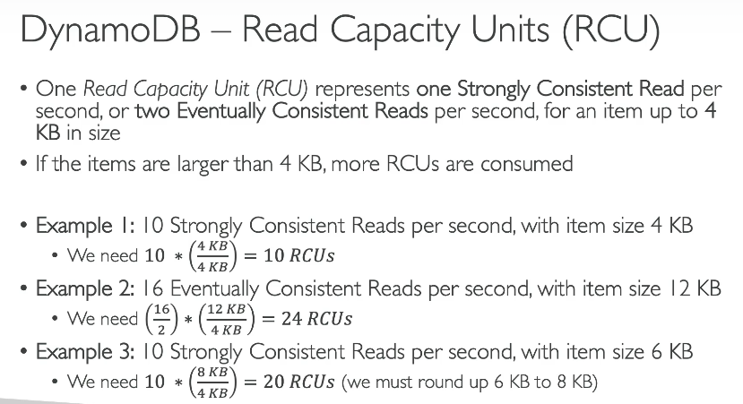

- **On-Demand Mode**: read/write automatically sclae up/down with your workloads. No capacity plan is needed, you pay per use (much more expensive). Comes with Write Request Uints (RRU) and Write Request Units (WRU). It is x2.5 expensive thn provision mode

You can switch betwenn these two modes every 24 hours.

#### DynamoDB Partitions Internal
Data is stored in tables with partitions.

***Partitions Keys go through a hashing algorithm to know to which partition they go***.

**WCUs and RCUs are spread evenly across partitions.**

#### DynamoDB Throttling
When you exceed provisioned RCUs or WCUs, we get the `ProvisionedTrhougputExceededException`. Some potential reasons for this are:
- Hot Keys (not enought spread of keys)
- Hot Partitions
- Very Large Items (remember WCUs and RCUs depend on size of items)

Solutions for this exception include:
- Exponential backoff when exception is encountered
- Distribute partition keys as much as possible
- If RCU issue, we can use DynamoDB Accelerator (DAX)

### DynamoDB API
#### Write data
For writting data we have the request types:
- PutItem: creates a new item or fully replaces an existing item
- UpdateItem: updates an existing item
- Conditional Writes: accept write/update/delete only if conditions are met, otherwise it returns an error

#### Read Data
- GetItem:
    - Read based on PK
    - PK can be HASH or HASH+RANGE
    - Eventually Consistent Read is the default setting
    - Option to use Strong Consistenet reads (more RCU and longer compute time)

The query returns items based on:
- KeyConditionExpressions on the partition key
- FilterExpression on non-key attributes

Additionally, you can scan a table to export the entire table.

#### Deleted Data
- DeleteItem
- DeleteTable: quicker than eleting each item with DeleteItem

#### Batch Operations
Allows you to save in latency by reducing the number of API calls

Operations are done in parallel for better efficiency.

Part of a btach can fail, in which case we need to retry again on the failed items.

- BatchWriteItem: up to 25 PutItem and/or DeleteItem in one call. Can't use UpdateItem
- BatchGetItem: returns items from one or more tables

#### PartiQL
This is a SQL compatible query language for DynamoDB that can be used instead of the API operators.

### DynamoDB Indexes
There are two types of indexes on DynamoDB:

- **Local Secondary Index (LSI)**

- **Gloabl Secondary Index (GSI)**

#### Local Secondary Index
This is an alternative sort key for your table (you have the same parition key as that of base table).
- The sort key consists of one scalar attibute (String, Number or Binary)
- You can have up to 5 LSI per table
- They must be defined at tabl creation
- Attribute Projections: can contain some or all te attributes of the base table

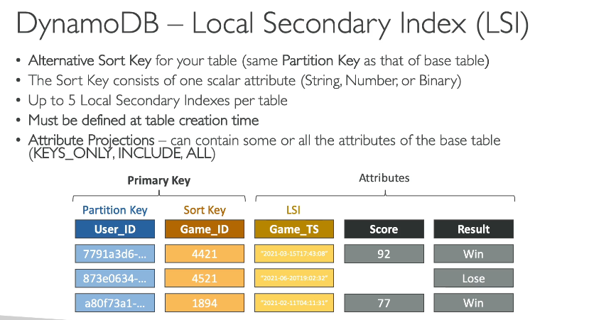

#### Global Secondary Index
This gives you an alternative PK (HASH or HASH+RANGE) from the base table
- Speeds up queries on non-key attributes
- The Index Key consists of scalar attributes (String, Number, Binary)
- Attribute Projections: some or all the attrbiutes of the base table
- Must provision RCUs & WCUs for the index
- Can be added and modified after table creation

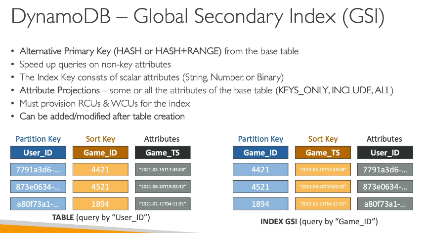

### DynamoDB PartiQL
PartiQL allows to use a SQL-syntax for DynamoDB tables
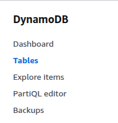

### DynamoDB Accelerator (DAX)
DAX is a fully-managed, highly available, seamless in-memory cache for DynamoDB. By creating a cluster, you can:
- Have runtimes of microseconds latency for cached reads and queries
- DAX does not require application logic modification (it's compatible with existing DynamoDB APIs)
- Solves the "Hot Key" problem (too many reads)

You create a DAX cluster. Your appliction wll interact with the cluster, whcih will fetch the data from the DynamoDB tables.
- Every cached piece of data will only be cahced for five minutes on your cluster (% minutes Time TO Live TTL)
- Clusters can have up to 10 nodes
- Clusters are Multi-AZ if the number of nodes is greater than 3 (3 nodes minimum for production as recommendation)
- Data supports encryption at rest withm KMS, VPC, IAM, CloudTrail...

*DAX caches individual objects or queries and scans.* If you want to have cached aggregation results, it's better to go for **Amazon Elasticache** 

### DynamoDB Streams
Streams are an ordenered list of item-modifications (create/update/delete) on a table.

This ordered list of item-modification can:
- Sent to Kinesis Data Streams
- Read by AWS Lambda
- Read by Kinesis Client Library applicatins

The data retention of streamss on DynamoDB is only 24 ours, so you neeed to stage them somewhere if you want to keep them.

Use cases for streams include:
- Reacting to changes in real-time (welcome email users)
- Analytics
- Insert into derivative tables
- Insert into OpenSearch Service
- Implement cross-region replication

***Streams will not be retroactivetily filled after activation.***

#### Stream Contents
We have te ability to choose the information that will be written to the stream:
- KEYS_ONLY: only the key attributes of the modified item
- NEW_IMAGE: shows the entire item as it appears upon mdification
- OLD_IMAGE: shows the item before the modification
- NEW_AND_OLD_IMAGES

#### Streams Architecture
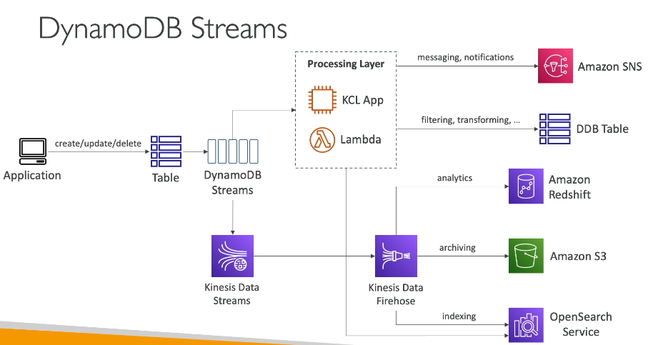

##### Streams & Lambda
For this integration you need to:
- Define an Event Source Mapping to read from a DynamoDB Streams
- Ensure the Lambda function has the appropiate permissions
- Then, the Lambda function will be invoked synchronously to your Stream
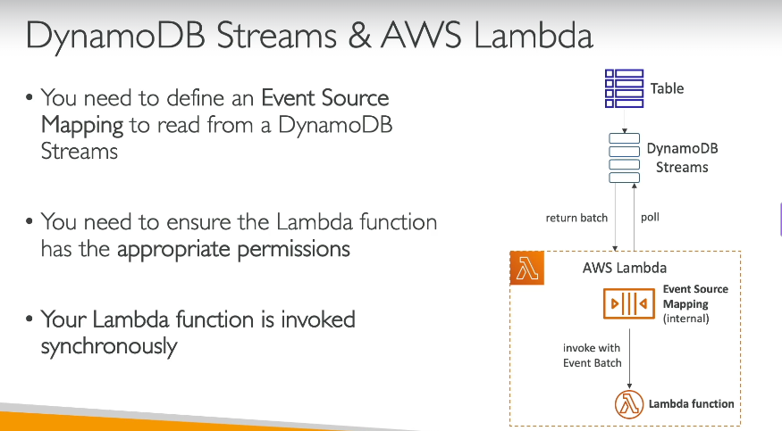